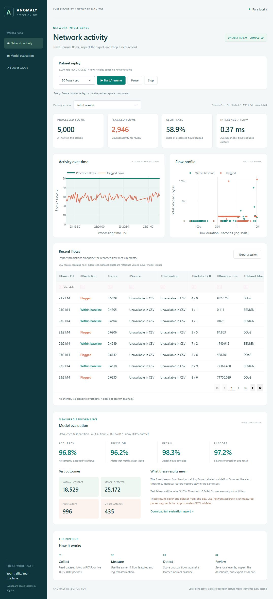

# Quick start

1. Install **Python 3.13**.
2. Clone this GitHub repository, or download its ZIP and extract it into a normal folder.
3. Open the project folder and run **SETUP_WINDOWS.cmd** once to install the required libraries into `.venv`.
4. Double-click **START_DASHBOARD.cmd**.
5. Keep the launch window open. The browser opens at **http://127.0.0.1:8050/**.
6. Click **Start / resume**.
7. Watch the processed-flow count, flagged flows, and charts update. Click **Pause** to inspect the recent-flow table.
8. Scroll to **Model evaluation** to see the measured test results.
9. Click **Export session** to download the complete event log.

The included model is already trained. Internet access is required for setup; the bundled dashboard demo runs offline afterwards.

The full training dataset is included as `data/network_traffic.csv.gz` to reduce repository size. Pandas reads it directly without manual extraction; the original CSV contents are unchanged. To retrain after setup, run `python model_training.py` using the project environment. The replay and test files remain `data/demo_flows.csv` and `data/test_flows.csv`.

Command-line setup on Windows, from the project folder:

```powershell
py -3.13 -m venv .venv
.\.venv\Scripts\python.exe -m pip install -r requirements.txt
.\.venv\Scripts\python.exe dashboard.py
```



**What you can demonstrate:** a real trained model scoring held-out dataset rows, consistent flow features, live dashboard updates, persistent events, session history, and exports. Separate commands support PCAP files and live packet capture.

**What to say about results:** "On the held-out portion of this CICIDS2017 DDoS dataset, the model achieved 96.83% accuracy, 96.19% precision, 98.30% recall, and 97.24% F1. Its false-positive rate was 5.10%."

These results apply to the included dataset. Dataset replay sends no network packets. Live-network accuracy is unmeasured, and a flagged anomaly is not automatically an attack.

Read **README.md** for the architecture, exact features, capture commands, Slack setup, tests, and limitations.
